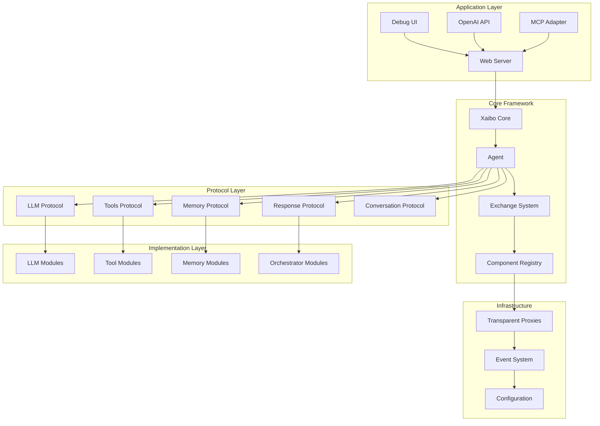
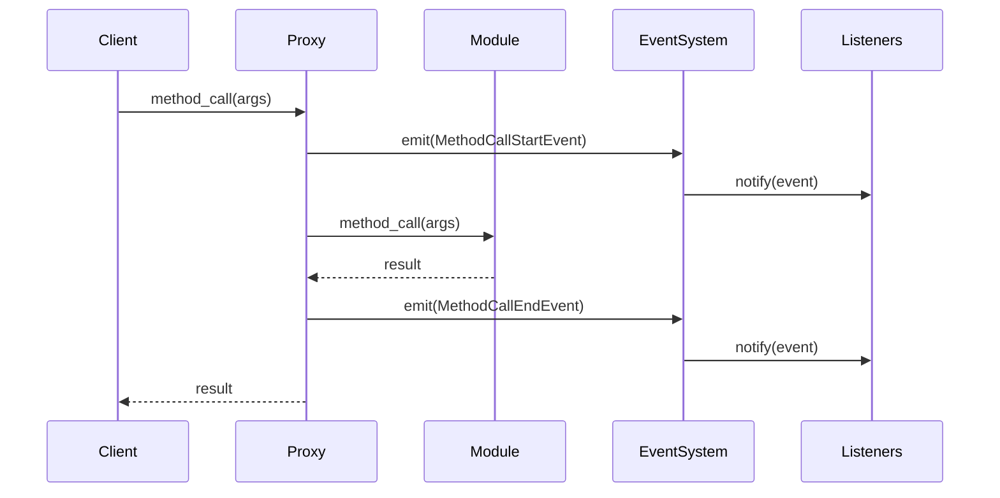
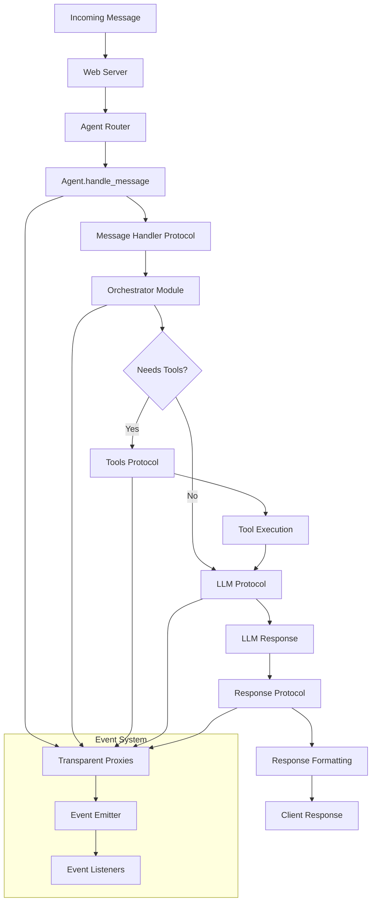
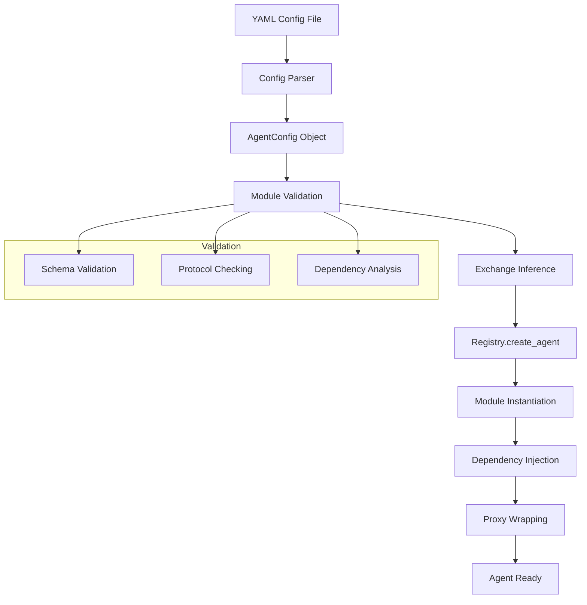

# Technical Architecture

This document provides a comprehensive overview of Xaibo's technical architecture, including system design principles, component relationships, and extension points for customization.

---

## System Architecture Overview

Xaibo is built on a **protocol-driven architecture** that emphasizes modularity, testability, and extensibility. The framework uses dependency injection and transparent proxies to create a flexible system where components can be easily swapped, tested, and monitored.



---

## Core Components

### 1. Xaibo Core

The [`Xaibo`](https://github.com/xpressai/xaibo/blob/main/src/xaibo/core/xaibo.py) class is the main entry point and orchestrator of the framework:

```python
class Xaibo:
    """Main framework class that manages agents and their lifecycle"""
    
    def __init__(self):
        self.registry = Registry()
        self.agents = {}
        self.event_listeners = []
    
    def create_agent(self, config: AgentConfig) -> Agent:
        """Create and configure an agent from configuration"""
        
    def load_agents_from_directory(self, directory: str):
        """Load multiple agents from YAML configurations"""
        
    def add_event_listener(self, listener: EventListener):
        """Add global event listener for monitoring"""
```

**Key Responsibilities:**
- Agent lifecycle management
- Configuration loading and validation
- Global event listener coordination
- Component registry management

### 2. Agent

The [`Agent`](https://github.com/xpressai/xaibo/blob/main/src/xaibo/core/agent.py) class represents a configured AI agent with specific capabilities:

```python
class Agent:
    """An AI agent with configured modules and capabilities"""
    
    def __init__(self, config: AgentConfig, registry: Registry):
        self.id = config.id
        self.config = config
        self.registry = registry
        self.modules = {}
        self.exchanges = {}
    
    async def handle_text_message(self, message: str) -> Response:
        """Process a text message and return a response"""
        
    async def handle_message(self, message: Message) -> Response:
        """Process any type of message"""
```

**Key Responsibilities:**
- Message routing and processing
- Module coordination
- Exchange management
- Response generation

### 3. Registry

The [`Registry`](https://github.com/xpressai/xaibo/blob/main/src/xaibo/core/registry.py) manages component instantiation and dependency resolution:

```python
class Registry:
    """Component registry for dependency injection and lifecycle management"""
    
    def __init__(self):
        self.instances = {}
        self.proxies = {}
        self.event_listeners = []
    
    def create_instance(self, module_config: ModuleConfig) -> Any:
        """Create and register a module instance"""
        
    def resolve_dependencies(self, instance: Any, exchanges: List[Exchange]):
        """Resolve and inject dependencies for an instance"""
        
    def create_proxy(self, instance: Any, module_id: str) -> Any:
        """Wrap instance with transparent proxy for observability"""
```

**Key Responsibilities:**
- Component instantiation
- Dependency injection
- Proxy creation and management
- Instance lifecycle tracking

---

## Protocol-Based Design

### Protocol Definition

Protocols in Xaibo are defined using Python's `typing.Protocol` to create structural type definitions:

```python
from typing import Protocol, runtime_checkable

@runtime_checkable
class LLMProtocol(Protocol):
    """Protocol for Language Model implementations"""
    
    async def generate_response(
        self, 
        messages: List[Message], 
        tools: Optional[List[Tool]] = None
    ) -> LLMResponse:
        """Generate a response from the language model"""
        ...
    
    async def stream_response(
        self, 
        messages: List[Message], 
        tools: Optional[List[Tool]] = None
    ) -> AsyncIterator[LLMResponse]:
        """Stream a response from the language model"""
        ...
```

### Core Protocols

#### 1. LLM Protocol

Defines the interface for language model interactions:

```python
class LLMProtocol(Protocol):
    async def generate_response(self, messages: List[Message], tools: Optional[List[Tool]] = None) -> LLMResponse
    async def stream_response(self, messages: List[Message], tools: Optional[List[Tool]] = None) -> AsyncIterator[LLMResponse]
```

**Implementations:**
- [`OpenAILLM`](https://github.com/xpressai/xaibo/blob/main/src/xaibo/primitives/modules/llm/openai.py)
- [`AnthropicLLM`](https://github.com/xpressai/xaibo/blob/main/src/xaibo/primitives/modules/llm/anthropic.py)
- [`GoogleLLM`](https://github.com/xpressai/xaibo/blob/main/src/xaibo/primitives/modules/llm/google.py)
- [`BedrockLLM`](https://github.com/xpressai/xaibo/blob/main/src/xaibo/primitives/modules/llm/bedrock.py)
- [`MockLLM`](https://github.com/xpressai/xaibo/blob/main/src/xaibo/primitives/modules/llm/mock.py)

#### 2. Tools Protocol

Defines the interface for tool providers:

```python
class ToolsProtocol(Protocol):
    def get_tools(self) -> List[Tool]
    async def execute_tool(self, tool_call: ToolCall) -> ToolResult
```

**Implementations:**
- [`PythonToolProvider`](https://github.com/xpressai/xaibo/blob/main/src/xaibo/primitives/modules/tools/python_tool_provider.py)
- [`MCPToolProvider`](https://github.com/xpressai/xaibo/blob/main/src/xaibo/primitives/modules/tools/mcp_tool_provider.py)

#### 3. Memory Protocol

Defines the interface for memory systems:

```python
class MemoryProtocol(Protocol):
    async def store(self, content: str, metadata: Optional[Dict] = None) -> str
    async def retrieve(self, query: str, limit: int = 10) -> List[MemoryItem]
    async def delete(self, memory_id: str) -> bool
```

**Implementations:**
- [`VectorMemory`](https://github.com/xpressai/xaibo/blob/main/src/xaibo/primitives/modules/memory/vector_memory.py)

#### 4. Response Protocol

Defines how agents send responses:

```python
class ResponseProtocol(Protocol):
    async def send_response(self, response: Response) -> None
```

#### 5. Conversation Protocol

Manages conversation history and context:

```python
class ConversationProtocol(Protocol):
    async def add_message(self, message: Message) -> None
    async def get_history(self, limit: Optional[int] = None) -> List[Message]
    async def clear_history(self) -> None
```

---

## Dependency Injection System

### Exchange Configuration

The exchange system defines how modules are connected through protocols:

```python
@dataclass
class Exchange:
    """Defines a connection between modules through protocols"""
    module: str          # Module that needs the dependency
    protocol: str        # Protocol interface required
    provider: Union[str, List[str]]  # Module(s) that provide the protocol
    field_name: Optional[str] = None  # Optional parameter name
```

### Dependency Resolution Process

1. **Module Instantiation**: Modules are created based on their configuration
2. **Dependency Analysis**: The registry analyzes each module's constructor to identify required protocols
3. **Exchange Matching**: Explicit exchanges are applied, and implicit ones are inferred
4. **Injection**: Dependencies are injected into module constructors or properties
5. **Proxy Wrapping**: All instances are wrapped with transparent proxies

```python
def resolve_dependencies(self, instance: Any, exchanges: List[Exchange]):
    """Resolve and inject dependencies for an instance"""
    
    # Get constructor signature
    signature = inspect.signature(instance.__class__.__init__)
    
    # Find matching exchanges for each parameter
    for param_name, param in signature.parameters.items():
        if param_name == 'self':
            continue
            
        # Check if parameter type is a protocol
        if hasattr(param.annotation, '__protocol__'):
            protocol_name = param.annotation.__name__
            
            # Find exchange that provides this protocol
            exchange = self.find_exchange(instance, protocol_name, param_name)
            
            if exchange:
                # Inject the dependency
                provider_instance = self.get_instance(exchange.provider)
                setattr(instance, param_name, provider_instance)
```

### Automatic Exchange Inference

When exchanges are not explicitly defined, Xaibo can automatically infer them:

```python
def infer_exchanges(self, modules: List[ModuleConfig]) -> List[Exchange]:
    """Automatically infer exchanges based on protocol requirements"""
    
    inferred = []
    
    for module in modules:
        # Analyze module's protocol requirements
        requirements = self.analyze_protocol_requirements(module)
        
        for protocol_name, param_name in requirements:
            # Find modules that provide this protocol
            providers = self.find_protocol_providers(modules, protocol_name)
            
            if len(providers) == 1:
                # Unambiguous match - create exchange
                inferred.append(Exchange(
                    module=module.id,
                    protocol=protocol_name,
                    provider=providers[0].id,
                    field_name=param_name
                ))
    
    return inferred
```

---

## Event System Architecture

### Event Flow

The event system provides comprehensive observability through transparent proxies:



### Event Types

```python
@dataclass
class MethodCallStartEvent:
    """Emitted when a method call begins"""
    module_id: str
    method_name: str
    args: Tuple
    kwargs: Dict
    timestamp: float
    call_id: str

@dataclass
class MethodCallEndEvent:
    """Emitted when a method call completes"""
    module_id: str
    method_name: str
    result: Any
    duration: float
    timestamp: float
    call_id: str
    exception: Optional[Exception] = None
```

### Transparent Proxies

Transparent proxies wrap every module instance to provide observability:

```python
class TransparentProxy:
    """Proxy that intercepts method calls for observability"""
    
    def __init__(self, target: Any, module_id: str, event_emitter: EventEmitter):
        self._target = target
        self._module_id = module_id
        self._event_emitter = event_emitter
    
    def __getattr__(self, name: str) -> Any:
        attr = getattr(self._target, name)
        
        if callable(attr):
            return self._wrap_method(attr, name)
        return attr
    
    def _wrap_method(self, method: Callable, method_name: str) -> Callable:
        """Wrap a method with event emission"""
        
        async def async_wrapper(*args, **kwargs):
            call_id = str(uuid.uuid4())
            start_time = time.time()
            
            # Emit start event
            self._event_emitter.emit(MethodCallStartEvent(
                module_id=self._module_id,
                method_name=method_name,
                args=args,
                kwargs=kwargs,
                timestamp=start_time,
                call_id=call_id
            ))
            
            try:
                result = await method(*args, **kwargs)
                
                # Emit success event
                self._event_emitter.emit(MethodCallEndEvent(
                    module_id=self._module_id,
                    method_name=method_name,
                    result=result,
                    duration=time.time() - start_time,
                    timestamp=time.time(),
                    call_id=call_id
                ))
                
                return result
                
            except Exception as e:
                # Emit error event
                self._event_emitter.emit(MethodCallEndEvent(
                    module_id=self._module_id,
                    method_name=method_name,
                    result=None,
                    duration=time.time() - start_time,
                    timestamp=time.time(),
                    call_id=call_id,
                    exception=e
                ))
                raise
        
        def sync_wrapper(*args, **kwargs):
            # Similar implementation for synchronous methods
            pass
        
        return async_wrapper if asyncio.iscoroutinefunction(method) else sync_wrapper
```

---

## Extension Points and Customization

### Creating Custom Modules

To create a custom module, implement the required protocols:

```python
from xaibo.core.protocols.llm import LLMProtocol
from xaibo.core.models.llm import LLMResponse, Message

class CustomLLM:
    """Custom LLM implementation"""
    
    def __init__(self, api_key: str, model: str):
        self.api_key = api_key
        self.model = model
    
    async def generate_response(
        self, 
        messages: List[Message], 
        tools: Optional[List[Tool]] = None
    ) -> LLMResponse:
        """Custom implementation of LLM response generation"""
        
        # Your custom logic here
        response_text = await self._call_custom_api(messages, tools)
        
        return LLMResponse(
            content=response_text,
            model=self.model,
            usage={"tokens": len(response_text.split())}
        )
    
    async def _call_custom_api(self, messages: List[Message], tools: Optional[List[Tool]]) -> str:
        """Call your custom API"""
        # Implementation details
        pass
```

### Custom Tool Providers

Create custom tool providers by implementing the `ToolsProtocol`:

```python
from xaibo.core.protocols.tools import ToolsProtocol
from xaibo.core.models.tools import Tool, ToolCall, ToolResult

class DatabaseToolProvider:
    """Tool provider for database operations"""
    
    def __init__(self, connection_string: str):
        self.connection_string = connection_string
        self._tools = self._create_tools()
    
    def get_tools(self) -> List[Tool]:
        """Return available database tools"""
        return self._tools
    
    async def execute_tool(self, tool_call: ToolCall) -> ToolResult:
        """Execute a database tool"""
        
        if tool_call.function.name == "query_database":
            result = await self._execute_query(tool_call.function.arguments["query"])
            return ToolResult(
                tool_call_id=tool_call.id,
                content=str(result)
            )
        
        raise ValueError(f"Unknown tool: {tool_call.function.name}")
    
    def _create_tools(self) -> List[Tool]:
        """Create tool definitions"""
        return [
            Tool(
                type="function",
                function={
                    "name": "query_database",
                    "description": "Execute a SQL query",
                    "parameters": {
                        "type": "object",
                        "properties": {
                            "query": {
                                "type": "string",
                                "description": "SQL query to execute"
                            }
                        },
                        "required": ["query"]
                    }
                }
            )
        ]
```

### Custom Event Listeners

Create custom event listeners for monitoring and debugging:

```python
from xaibo.core.protocols.event_listeners import EventListener
from xaibo.core.models.events import Event

class MetricsEventListener(EventListener):
    """Event listener that collects performance metrics"""
    
    def __init__(self):
        self.call_counts = {}
        self.response_times = {}
    
    async def handle_event(self, event: Event):
        """Handle incoming events"""
        
        if isinstance(event, MethodCallStartEvent):
            self._record_call_start(event)
        elif isinstance(event, MethodCallEndEvent):
            self._record_call_end(event)
    
    def _record_call_start(self, event: MethodCallStartEvent):
        """Record method call start"""
        key = f"{event.module_id}.{event.method_name}"
        self.call_counts[key] = self.call_counts.get(key, 0) + 1
    
    def _record_call_end(self, event: MethodCallEndEvent):
        """Record method call completion"""
        key = f"{event.module_id}.{event.method_name}"
        if key not in self.response_times:
            self.response_times[key] = []
        self.response_times[key].append(event.duration)
    
    def get_metrics(self) -> Dict[str, Any]:
        """Get collected metrics"""
        return {
            "call_counts": self.call_counts,
            "average_response_times": {
                key: sum(times) / len(times)
                for key, times in self.response_times.items()
            }
        }
```

---

## Data Flow Architecture

### Message Processing Flow



### Configuration Loading Flow



---

## Performance Considerations

### Memory Management

- **Lazy Loading**: Modules are instantiated only when needed
- **Singleton Pattern**: Modules are reused across agents when possible
- **Memory Cleanup**: Automatic cleanup of unused instances
- **Vector Index Optimization**: Efficient storage and retrieval of embeddings

### Concurrency

- **Async/Await**: Full async support throughout the framework
- **Connection Pooling**: Efficient management of external API connections
- **Request Batching**: Batching of similar requests to improve throughput
- **Resource Limits**: Configurable limits to prevent resource exhaustion

### Caching Strategies

- **Response Caching**: Cache LLM responses for identical inputs
- **Tool Result Caching**: Cache expensive tool operations
- **Configuration Caching**: Cache parsed configurations
- **Vector Index Caching**: Cache frequently accessed embeddings

---

## Security Architecture

### Input Validation

- **Schema Validation**: All inputs validated against Pydantic schemas
- **Content Filtering**: Dangerous content detection and filtering
- **Rate Limiting**: Per-client request rate limiting
- **Size Limits**: Maximum request and response size limits

### Access Control

- **API Key Authentication**: Secure API key management
- **Role-Based Access**: Different access levels for different users
- **Audit Logging**: Complete audit trail of all operations
- **Secure Defaults**: Security-first default configurations

### Data Protection

- **Encryption at Rest**: Sensitive data encrypted when stored
- **Encryption in Transit**: All communications encrypted
- **Secret Management**: Secure handling of API keys and secrets
- **Data Isolation**: Proper isolation between different agents and users

---

!!! tip "Next Steps"
    - Explore the [API Reference](api-reference.md) for detailed implementation details
    - Check out [Examples](examples.md) for practical implementation patterns
    - Review [Deployment](deployment.md) for production architecture considerations