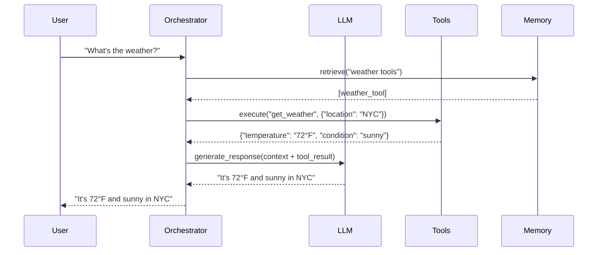

# Features

Xaibo provides a comprehensive set of features designed to make building, testing, and deploying AI agents both powerful and straightforward. This page explores the key capabilities that set Xaibo apart.

---

## Protocol-Based Architecture

Xaibo's foundation is built on well-defined protocol interfaces that create clean boundaries between components.

### Clean Separation of Concerns

Components interact only through protocols, not implementation details. This means:

- **Modular Design**: Each component has a single, well-defined responsibility
- **Interface Contracts**: Clear expectations for what each component provides
- **Implementation Independence**: Internal changes don't affect other components

```python title="Example: Protocol Interface"
class LLMProtocol:
    async def generate_response(self, messages: List[Message]) -> LLMResponse:
        """Generate a response from the language model"""
        pass
    
    def supports_streaming(self) -> bool:
        """Whether the LLM supports streaming responses"""
        pass
```

### Easy Testing with Mocks

Mock any component by providing an alternative that implements the same protocol:

```python title="Example: Mock LLM for Testing"
class MockLLM(LLMProtocol):
    def __init__(self, responses: List[str]):
        self.responses = responses
        self.call_count = 0
    
    async def generate_response(self, messages: List[Message]) -> LLMResponse:
        response = self.responses[self.call_count % len(self.responses)]
        self.call_count += 1
        return LLMResponse(content=response)
    
    def supports_streaming(self) -> bool:
        return False
```

### Flexible Composition

Mix and match components as long as they fulfill required protocols:

```yaml title="Example: Swapping LLM Providers"
# Development configuration with OpenAI
modules:
  - module: xaibo.primitives.modules.llm.OpenAILLM
    id: llm
    config:
      model: gpt-3.5-turbo

# Production configuration with Anthropic
modules:
  - module: xaibo.primitives.modules.llm.AnthropicLLM
    id: llm
    config:
      model: claude-3-sonnet-20240229
```

---

## Dependency Injection

Components explicitly declare what they need, enabling superior architecture and testing.

### Easy Implementation Swapping

Change implementations without rewriting core logic:

!!! example "Memory Backend Switching"
    ```yaml
    # SQLite for development
    - module: xaibo.primitives.modules.memory.SQLiteMemory
      id: memory
      config:
        database_path: ./dev_memory.db
    
    # Cloud vector database for production
    - module: xaibo.primitives.modules.memory.PineconeMemory
      id: memory
      config:
        api_key: ${PINECONE_API_KEY}
        environment: production
    ```

### Superior Testing Capabilities

Inject predictable mocks instead of real services:

```python title="Example: Testing with Dependency Injection"
def test_agent_with_mock_llm():
    # Create mock LLM with predictable responses
    mock_llm = MockLLM(responses=["Hello, I'm a test response!"])
    
    # Inject mock into agent
    agent = create_agent_with_dependencies(llm=mock_llm)
    
    # Test behavior is now predictable
    response = await agent.handle_message("Hello")
    assert response.content == "Hello, I'm a test response!"
```

### Clear Architectural Boundaries

Explicit dependencies create better architecture:

```python title="Example: Clear Dependencies"
class AdvancedOrchestrator:
    def __init__(
        self,
        llm: LLMProtocol,
        memory: MemoryProtocol,
        tools: ToolsProtocol,
        response_handler: ResponseProtocol
    ):
        # Dependencies are explicit and clear
        self.llm = llm
        self.memory = memory
        self.tools = tools
        self.response_handler = response_handler
```

---

## Transparent Proxies

Every component is wrapped with a "two-way mirror" that provides complete observability without changing component behavior.

### Complete Call Observation

Every method call is captured with full context:

- **Parameters**: All input arguments and their values
- **Return Values**: Complete response data
- **Timing Information**: Execution duration and timestamps
- **Exception Details**: Full error context when things go wrong

```python title="Example: Captured Call Information"
{
    "component_id": "llm",
    "method": "generate_response",
    "parameters": {
        "messages": [{"role": "user", "content": "Hello"}]
    },
    "start_time": "2024-01-15T10:30:00Z",
    "end_time": "2024-01-15T10:30:02Z",
    "duration_ms": 2000,
    "return_value": {
        "content": "Hello! How can I help you?",
        "tokens_used": 15
    },
    "exception": null
}
```

### Runtime Insights

Gain detailed visibility into your agent's operations:

- **Performance Monitoring**: Identify slow components and bottlenecks
- **Behavior Analysis**: Understand how your agent makes decisions
- **Error Tracking**: Comprehensive error context for debugging
- **Usage Patterns**: See how different components are utilized

### Automatic Test Case Generation

Production runs automatically generate test cases:

```python title="Example: Auto-Generated Test"
# Generated from actual production call
def test_llm_response_to_greeting():
    mock_llm = MockLLM(responses=["Hello! How can I help you?"])
    
    # This test was generated from observing real behavior
    response = await mock_llm.generate_response([
        {"role": "user", "content": "Hello"}
    ])
    
    assert response.content == "Hello! How can I help you?"
    assert response.tokens_used == 15
```

---

## Comprehensive Event System

Built-in event system provides real-time monitoring and debugging capabilities.

### Debug Event Viewer

Visual inspection of agent operations in real-time:

- **Component Interactions**: See how modules communicate
- **Data Flow**: Track information as it moves through the system
- **Decision Points**: Understand where and why decisions are made
- **Error Propagation**: Follow errors through the system

### Call Sequence Tracking

Track every interaction between components:



### Performance Monitoring

Identify bottlenecks and optimize agent behavior:

- **Component Timing**: See which components take the most time
- **Resource Usage**: Monitor memory and CPU utilization
- **API Call Patterns**: Track external service usage
- **Caching Effectiveness**: Measure cache hit rates

!!! info "Performance Dashboard"
    The debug UI includes performance metrics showing:
    
    - Average response times per component
    - Total API calls and costs
    - Memory usage patterns
    - Error rates and types

---

## Web Server and API Adapters

Xaibo includes production-ready server capabilities with multiple API compatibility layers.

### OpenAI API Compatibility

Use Xaibo with any client that supports the OpenAI Chat Completions API:

```python title="Server Setup"
from xaibo import Xaibo
from xaibo.server import XaiboWebServer
from xaibo.server.adapters.openai import OpenAiApiAdapter

# Initialize and start server
xaibo = Xaibo()
xaibo.register_agent(my_agent_config)

server = XaiboWebServer(
    xaibo=xaibo,
    adapters=[OpenAiApiAdapter(xaibo)]
)
server.run(host="0.0.0.0", port=8000)
```

#### Compatible Clients

Works with any OpenAI-compatible client:

- **OpenAI Python SDK**
- **LangChain**
- **LlamaIndex**
- **Custom HTTP clients**

```python title="Example: Using with OpenAI SDK"
import openai

client = openai.OpenAI(
    base_url="http://localhost:8000/openai",
    api_key="not-needed"  # Xaibo doesn't require API keys
)

response = client.chat.completions.create(
    model="my-agent",
    messages=[{"role": "user", "content": "Hello!"}]
)
```

### MCP (Model Context Protocol) Adapter

Expose Xaibo agents as MCP tools for integration with MCP-compatible applications:

```python title="MCP Server Setup"
from xaibo.server.adapters.mcp import McpApiAdapter

server = XaiboWebServer(
    xaibo=xaibo,
    adapters=[McpApiAdapter(xaibo)]
)
```

#### MCP Integration Benefits

- **IDE Integration**: Use agents directly in development environments
- **Tool Ecosystem**: Access to MCP-compatible tools and resources
- **Standardized Protocol**: Industry-standard communication format

### Multiple Adapter Support

Run multiple API adapters simultaneously:

```python title="Multi-Adapter Setup"
server = XaiboWebServer(
    xaibo=xaibo,
    adapters=[
        "xaibo.server.adapters.OpenAiApiAdapter",
        "xaibo.server.adapters.McpApiAdapter",
        "xaibo.server.adapters.CustomApiAdapter"
    ]
)
```

---

## Advanced Tool Integration

Xaibo provides multiple ways to integrate tools and external capabilities.

### Python Tool Provider

Convert Python functions into agent tools with simple decorators:

```python title="Python Tools"
from xaibo.primitives.modules.tools.python_tool_provider import tool
from datetime import datetime
import requests

@tool
def get_current_time(timezone: str = "UTC"):
    """Get the current time in the specified timezone"""
    return datetime.now().strftime(f"%Y-%m-%d %H:%M:%S {timezone}")

@tool
def fetch_weather(city: str):
    """Fetch current weather for a city"""
    # Tool implementation
    response = requests.get(f"https://api.weather.com/v1/current?q={city}")
    return response.json()
```

### MCP Tool Provider

Connect to MCP (Model Context Protocol) servers for advanced tool capabilities:

```yaml title="MCP Configuration"
modules:
  - id: mcp-tools
    module: xaibo.primitives.modules.tools.MCPToolProvider
    config:
      servers:
        # Local filesystem server
        - name: filesystem
          transport: stdio
          command: ["python", "-m", "mcp_server_filesystem"]
          args: ["--root", "/workspace"]
        
        # Remote web search server
        - name: web_search
          transport: sse
          url: "https://api.example.com/mcp"
          headers:
            Authorization: "Bearer ${API_KEY}"
```

### Tool Namespacing

Tools from different providers are automatically namespaced:

- **Python tools**: `function_name`
- **MCP tools**: `server_name.tool_name`
- **Custom tools**: Configurable naming schemes

---

## Memory and Embeddings

Sophisticated memory capabilities for context-aware agents.

### Vector Memory System

Semantic memory using vector embeddings:

```yaml title="Memory Configuration"
modules:
  - module: xaibo.primitives.modules.memory.VectorMemory
    id: memory
    config:
      memory_file_path: ./agent_memory.pkl
  
  - module: xaibo.primitives.modules.memory.SentenceTransformerEmbedder
    id: embedder
    config:
      model_name: "all-MiniLM-L6-v2"
  
  - module: xaibo.primitives.modules.memory.TokenChunker
    id: chunker
    config:
      window_size: 512
      window_overlap: 50
```

### Multiple Embedding Providers

Choose from various embedding providers:

- **Local Models**: Sentence Transformers, Hugging Face
- **Cloud APIs**: OpenAI embeddings
- **Custom Embedders**: Implement your own embedding logic

### Intelligent Chunking

Automatic text chunking with overlap for better context preservation:

- **Token-based chunking**: Respects model token limits
- **Semantic chunking**: Preserves meaning across chunks
- **Configurable overlap**: Maintains context between chunks

---

## Development and Debugging

Comprehensive development tools for building and maintaining agents.

### Hot Reloading

Automatic reloading during development:

```bash
# Start development server with hot reloading
uv run xaibo dev --reload
```

Changes to agent configurations and tools are automatically detected and reloaded.

### Comprehensive Logging

Detailed logging at multiple levels:

- **Debug**: Detailed execution traces
- **Info**: High-level operation summaries
- **Warning**: Potential issues and fallbacks
- **Error**: Detailed error context and stack traces

### Test Generation

Automatic test case generation from production runs:

- **Interaction Recording**: Capture real agent interactions
- **Mock Generation**: Create mocks from recorded behavior
- **Regression Testing**: Ensure consistent behavior across changes

---

## Production Features

Enterprise-ready capabilities for deploying agents at scale.

### Configuration Management

Flexible configuration with environment variable support:

```yaml title="Environment-Aware Configuration"
modules:
  - module: xaibo.primitives.modules.llm.OpenAILLM
    id: llm
    config:
      model: ${LLM_MODEL:gpt-3.5-turbo}
      api_key: ${OPENAI_API_KEY}
      timeout: ${LLM_TIMEOUT:60.0}
```

### Error Handling

Robust error handling with graceful degradation:

- **Retry Logic**: Automatic retries for transient failures
- **Fallback Mechanisms**: Alternative providers when primary fails
- **Circuit Breakers**: Prevent cascade failures

### Monitoring and Metrics

Built-in monitoring capabilities:

- **Health Checks**: Endpoint monitoring for all components
- **Metrics Collection**: Performance and usage statistics
- **Alert Integration**: Connect to monitoring systems

---

## Next Steps

Explore how to organize and structure larger Xaibo projects:

- **[Project Structure](project-structure.md)**: Learn about organizing complex agent systems
- **[Getting Started](getting-started.md)**: Review the basics if you need a refresher
- **[Core Concepts](core-concepts.md)**: Deepen your understanding of protocols and modules

These features work together to provide a comprehensive platform for building, testing, and deploying sophisticated AI agents.