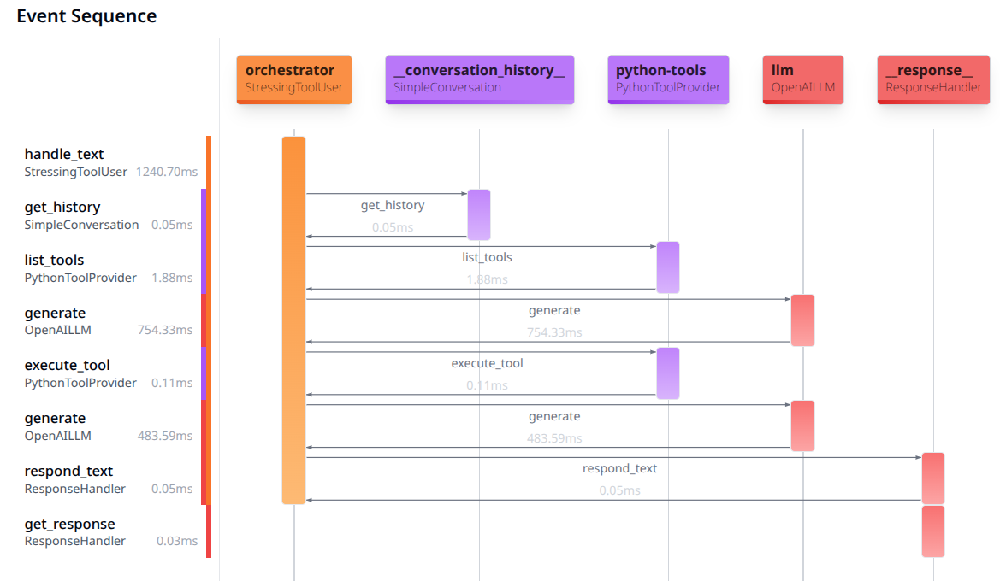
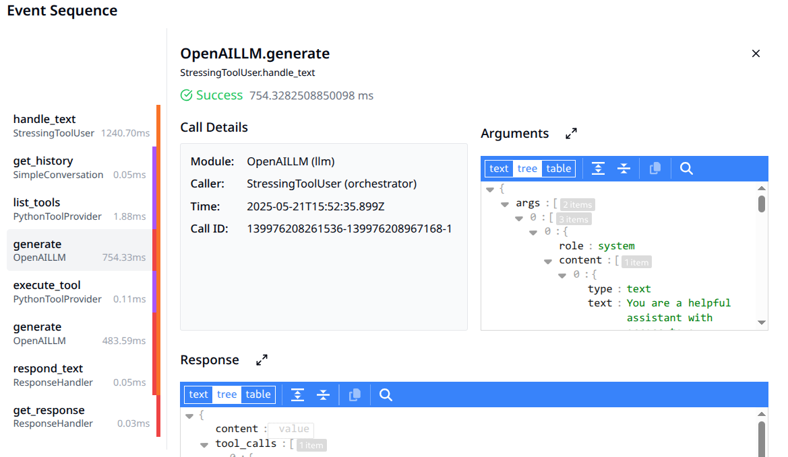

<div class="hero-section" style="margin-top: -4em">
      <h1 style="color: white">
      <svg xmlns="http://www.w3.org/2000/svg" style="margin-bottom: -8px" width="64" height="64" viewBox="0 0 24 24" fill="none" stroke="currentColor" stroke-width="2" stroke-linecap="round" stroke-linejoin="round" class="lucide lucide-bot-icon lucide-bot"><path d="M12 8V4H8"/><rect width="16" height="12" x="4" y="8" rx="2"/><path d="M2 14h2"/><path d="M20 14h2"/><path d="M15 13v2"/><path d="M9 13v2"/></svg>
       Xaibo
      </h1>
      <p>A modular agent framework designed for building flexible AI systems with clean protocol-based interfaces</p>
      <div style="margin-top: 2rem;">
        <a href="{{ 'getting-started/' | url }}" class="md-button md-button--primary" style="margin-right: 1rem;">
          Get Started
        </a>
        <a href="{{ config.repo_url }}" class="md-button" style="background: rgba(255,255,255,0.2); color: white;">
          View on GitHub
        </a>
      </div>
    </div>

<div class="feature-grid">
  <div class="feature-card">
    <h3>🧩 Modular Architecture</h3>
    <p>Easily swap components without changing other parts of the system. Want to switch from OpenAI to Anthropic? Just change the configuration.</p>
  </div>
  <div class="feature-card">
    <h3>🔌 Protocol-Based Design</h3>
    <p>Components communicate through well-defined interfaces, creating clean boundaries and enabling superior testing capabilities.</p>
  </div>
  <div class="feature-card">
    <h3>🔍 Complete Observability</h3>
    <p>Every component interaction is captured with transparent proxies, providing detailed runtime insights and automatic test case generation.</p>
  </div>
</div>

## What is Xaibo?

Xaibo is a powerful, protocol-driven framework that enables developers to build sophisticated AI agents with unprecedented flexibility and modularity. By using well-defined interfaces and dependency injection, Xaibo allows you to create, test, and deploy AI systems that are both robust and easily maintainable.

!!! tip "Quick Start"
    Get up and running with Xaibo in minutes:
    ```bash
    pip install uv
    uvx xaibo init my_project
    cd my_project
    uv run xaibo dev
    ```

## Why Choose Xaibo?

### 🧩 **Modular Architecture**
Easily swap components without changing other parts of the system. Want to switch from OpenAI to Anthropic? Just change the configuration.

### 🔌 **Protocol-Based Design**
Components communicate through well-defined interfaces, creating clean boundaries and enabling superior testing capabilities.

### 🔍 **Complete Observability**
Every component interaction is captured with transparent proxies, providing detailed runtime insights and automatic test case generation.

### 🚀 **Production Ready**
Built-in web server with OpenAI-compatible API and MCP (Model Context Protocol) support for seamless integration.

---

## Key Features

<div class="grid cards" markdown>

-   :material-puzzle-outline: **Protocol-Based Architecture**

    ---

    Components interact through well-defined protocol interfaces, creating clear boundaries and enabling easy testing with mocks.

-   :material-swap-horizontal: **Dependency Injection**

    ---

    Explicitly declare what components need, making it easy to swap implementations and inject predictable mocks for testing.

-   :material-eye-outline: **Transparent Proxies**

    ---

    Every component is wrapped with observability that captures parameters, timing, and exceptions for complete visibility.

-   :material-chart-timeline-variant: **Comprehensive Event System**

    ---

    Built-in event system provides real-time monitoring, call sequences tracking, and performance insights.

</div>

---

## Quick Navigation

<div class="grid cards" markdown>

-   :material-rocket-launch: **[Getting Started](getting-started.md)**

    ---

    Installation guide, quick start tutorial, and your first Xaibo agent

-   :material-brain: **[Core Concepts](core-concepts.md)**

    ---

    Understanding protocols, modules, and exchanges - the building blocks of Xaibo

-   :material-feature-search: **[Features](features.md)**

    ---

    Detailed exploration of Xaibo's key features and capabilities

-   :material-file-tree: **[Project Structure](project-structure.md)**

    ---

    How to organize your Xaibo projects and understand the framework architecture

</div>

---

## Example: Your First Agent

Here's what a simple Xaibo agent looks like:

```yaml title="agents/example.yml"
id: example
description: An example agent that uses tools
modules:
  - module: xaibo.primitives.modules.llm.OpenAILLM
    id: llm
    config:
      model: gpt-3.5-turbo
  - id: python-tools
    module: xaibo.primitives.modules.tools.PythonToolProvider
    config:
      tool_packages: [tools.example]
  - module: xaibo.primitives.modules.orchestrator.StressingToolUser
    id: orchestrator
    config:
      max_thoughts: 10
      system_prompt: |
        You are a helpful assistant with access to a variety of tools.
```

```python title="tools/example.py"
from datetime import datetime, timezone
from xaibo.primitives.modules.tools.python_tool_provider import tool

@tool
def current_time():
    'Gets the current time in UTC'
    return datetime.now(timezone.utc).strftime("%Y-%m-%d %H:%M:%S UTC")
```

## Interact with Your Agent

Once your development server is running, interact with it using the OpenAI-compatible API:

```bash
curl -X POST http://127.0.0.1:9001/openai/chat/completions \
  -H "Content-Type: application/json" \
  -d '{
    "model": "example",
    "messages": [
      {"role": "user", "content": "Hello, what time is it now?"}
    ]
  }'
```

---

## Visual Debug Interface

Xaibo includes a powerful debug UI that visualizes your agent's operations in real-time:

<div style="display: flex; gap: 10px; margin: 20px 0;">
  <div style="flex: 1;">
    
    <p><em>Sequence Diagram Overview</em></p>
  </div>
  <div style="flex: 1;">
    
    <p><em>Detail View of Component Interactions</em></p>
  </div>
</div>

---

## Community & Support

<div class="grid cards" markdown>

-   :fontawesome-brands-github: **[GitHub Repository](https://github.com/xpressai/xaibo)**

    ---

    Source code, issues, and contributions

-   :fontawesome-brands-discord: **[Discord Community](https://discord.gg/uASMzSSVKe)**

    ---

    Join our community for support and discussions

-   :material-email: **[Contact Us](mailto:hello@xpress.ai)**

    ---

    Get in touch with the Xaibo team

</div>

---

!!! info "Ready to Build?"
    Start with our [Getting Started guide](getting-started.md) to create your first Xaibo agent, or dive into [Core Concepts](core-concepts.md) to understand the framework's architecture.
